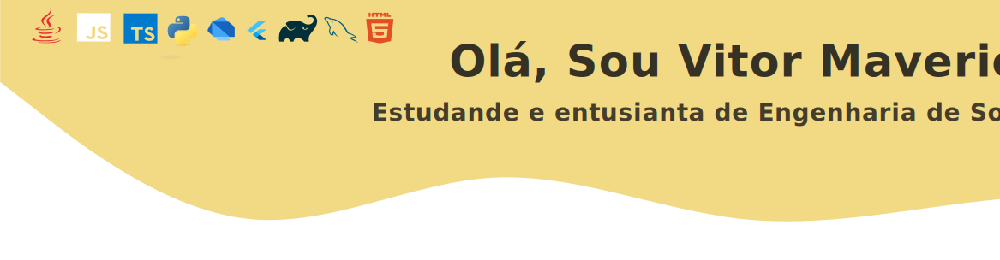

  

 
  
    Sou estudante de Sistemas de Informação 
no IFMA, onde atualmente estou estudando padrões de projeto 
com java e desenvolvimento mobile com flutter.  

  
Durante minha trajetória no curso técnico e universidade tive 
contato as linguagens c, python, java, javascript e dart. Meu 
objetivo é aprender a desenvolver sistemas, que independente da 
linguagem, sigam os principais padrões arquiteturais e de projeto. 

  
  ##
  
  
  
  
   
  
 

  
  ##
 

  <a href="https://github.com/VitorMaverick">
  

  

 
 
  
 

