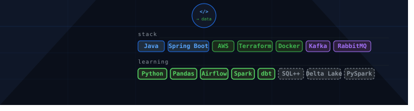

## 👋 Sobre mim

4 anos de experiência com sistemas de pagamento em produção — Kafka, AWS, Terraform, microsserviços, milhões de transações.
Migrando pra engenharia de dados. Python, Pandas, um pouco de ML.
Estudante de Sistemas de Informação no IFMA.

 
  
   
  
   
  

---

## 🛠️ Tecnologias mais utilizadas

  
  
  
  
  
  
  
  

  
  
  
  

---

<picture>
  <source media="(prefers-color-scheme: dark)" srcset="https://github.com" style="display: none;">
  <!-- O truque oficial para ler de outra branch no próprio repositório: -->
  <source media="(prefers-color-scheme: dark)" srcset="../output/github-snake-dark.svg">
  <source media="(prefers-color-scheme: light)" srcset="../output/github-snake.svg">
  
</picture>

